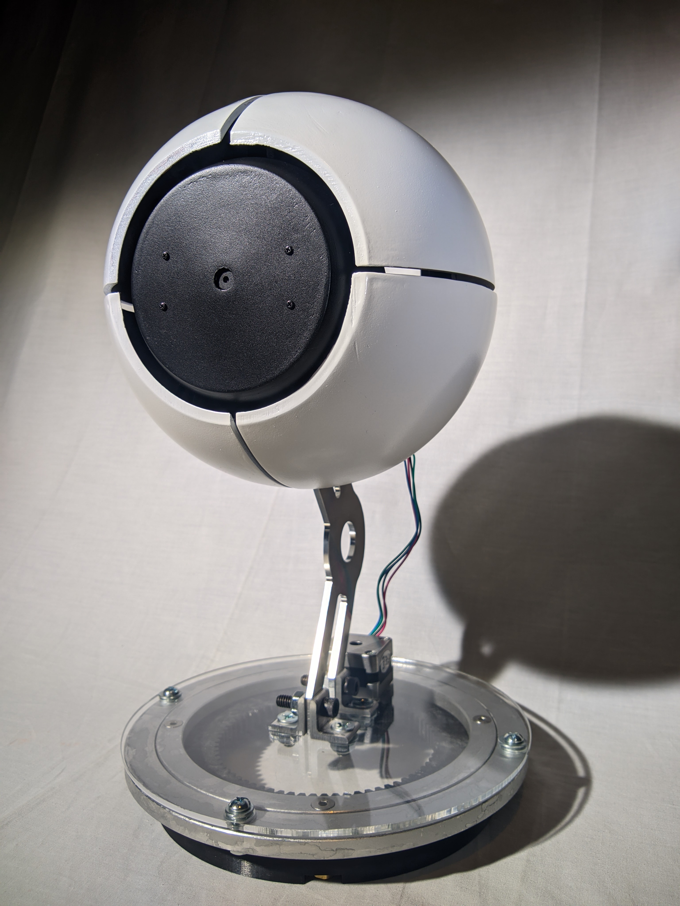

# Mr. I
Eye contact is one of the most important parts of communication between humans. It
shows that a person is listening and paying attention to what is being said. Modern
robotic assistants like Amazon Echo or Google Home seem to be missing this crucial
part, leaving the user with nothing to focus on when they are speaking to the robot.
This project seeks to mitigate this issue with the design of Mr. I, a one-eyed face
tracking robot that a user would be able to maintain eye contact with. The goal is to
make it easier for a person to have a conversation with the robot, facilitating human-
robot interaction. The project was successful in that regard as the robot accurately
tracks faces and peer feedback has been largely positive.

